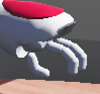

# NAO Robot - Italian Sign Language


## Table Of Content
* [Introduction](#introduction)
* [Getting Started](#getting-started)
    * [Prerequisites](#prerequisites)
    * [Install](#install)
    * [Run](#run)
* [The Dictionary](#the-dictionary)
* [Motions Details](#motions)
* [Authors](#authors)

## Introduction
The project is the development of an educational social robot 
to be used at home and/or school to support the learning of **deaf** people. 
In particular, this is a "gamification" project that 
allows users to learn the **Italian Sign Language (ISL)**  through 
a playful activity provided by the robot. 
The user chooses, among a list, the verb he wants to learn, 
then the robot execute the corresponding sign. 
For this purpose, we have chosen [NAO robot](https://www.softbankrobotics.com/emea/en/nao), a small humanoid robot that can 
replicate human gestures and movements. 

Four main components have been identified to describe a sign:
* **location**: place where the sign takes place (e.g. head, chest).
* **hand configuration**: position of the involved hand parts in the sign. 
* **hand orientation**: orientation of the hand parts involved in the sign (degrees).  
* **movement**: how the movement of the sign is performed takes place (e.g. circular movement of the arm).

Using these components, it's possible to define new signs. 
See [The Dictionary](#the-dictionary) section to find out how 
you can define a sign).

The **location** is also used to improve the interaction with the user. 
The place of execution of a sign (i.e location) is influenced by its 
category (e.g. verbs that refer to an emotion are executed near the chest). 
The robot uses this categorization to propose verbs that have the same 
location as the verb he chooses.
    
For more info about this project see the [project report](#).

## Getting Started
### Prerequisites
This project is tested on `Python 2.7`.

Before proceeding, install [Webots](https://cyberbotics.com) following the [official guide](https://cyberbotics.com/doc/guide/installing-webots).

### Install
* Clone this repository:
```
git clone https://github.com/FaMoSi/SocialRobot-ISL
```

* Change into it:
```
cd SocialRobot-ISL
```

* Edit the `local_path` in [utils.py](./utils.py). It has to points to the `SocialRobot-ISL` cloned repository.

That's all, everything is installed and you can run the NAO-ISL robot!

### Run
You can run the project following these steps:
* Open [Webots](https://cyberbotics.com).
* From the menu bar click on `File -> Open World...`.
* Select the [LIS-Nao.wbt](./worlds/LIS-Nao.wbt) file. You can find it in `~/SocialRobot-ISL/worlds/LIS-Nao.wbt`
* Click the **Play** button.
* Follow the instructions shown in the console.

**NB: The robot waits for pressed key. Make sure the 3D window of [Webots](https://cyberbotics.com) is selected and the simulation is running.**

## The Dictionary
[The dictionary](./sign_dictionary.json) is a json file where the signs are defined. 
It has the following format:
```
{
  "verb": [
    # RIGHT
    {
      "location": location,
      "hand_configuration": hand_configuration,
      "hand_orientation": hand_orientation,
      "movement": [movement_1, movement_2, ..., movement_n]
    },
    # LEFT
    {
      "location": location,
      "hand_configuration": hand_configuration,
      "hand_orientation": hand_orientation,
      "movement": [movement_1, movement_2, ..., movement_n]
    }
  ],
  .....
}
```

The signs for the following verbs are already defined in the [sing dictionary](./sign_dictionary.json):
* Mental Activity (**Head** Location):
    * Think 
    * Know 
    * Remember
    * Forget
    * Reason 
* Emotions (**Chest** Location):
    * Angry
    * Jealousy
    * Trust 
    * Envy
    * Love

### How to add new signs
**Add a new sign defintion to the [dictionary](./sign_dictionary.json)**:
* open the [sing dictionary.json](./sign_dictionary.json) file.
* copy and paste this code fragment:
```
"name_sign": [
    {
      "location": location_value,
      "hand_configuration": hand_configuration_value,
      "hand_orientation": hand_orientation_value,
      "movement": [movement_value_1, movement_value_2, ..., movement_value_n]
    },
    {
      "location": location_value,
      "hand_configuration": hand_configuration_value,
      "hand_orientation": hand_orientation_value,
      "movement": [movement_value_1, movement_value_2, ..., movement_value_n]
    }
  ]
```
* edit `name_sign` and `parameters_values` with the corresponding ones.

**Assign a key to the new defined sign**:
* open the [controlle_lis.py](./controllers/controller_lis/controller_lis.py) file.
* uncomment [this code](https://github.com/FaMoSi/SocialRobot-ISL/blob/59b83af3e238a5d30099c847586b834ccf9cc7a4/controllers/controller_lis/controller_lis.py#L216):
```
"""
   if key == ord('NEW_KEY'):
     input = "new_sign"
     self.execute_sign(data[input])
"""
```
* replace:
    * `NEW_KEY` with the **new key** you want to be pressed (**Uppercase letter**) 
    * `new_sign` with the new `name_sign` you defined in the [dictionary](./sign_dictionary.json)

**Now you can perform the new sign by following the instructions in the [Getting Started](#getting-started) section.


## Motions

<details>
<summary><b><i>configuration</i></b></summary>
The <b>configuration</b> motions refer to specific <b>hand</b> configurations.
Their names can be <b>figurative</b> or <b>explicative</b>. 
<br>
To avoid confusion, here are shown the <b>configurations</b> for the <b>figurative</b> names:
<br>
<br>

Beak            |  Scratch
:-------------------------:|:-------------------------:
  |  


</details>


<details>
<summary><b><i>location</i></b></summary>
</details>

<details>
<summary><b><i>movement</i></b></summary>
</details>

<details>
<summary><b><i>orientation</i></b></summary>
</details>

## Authors
**[Simone Faggi](https://github.com/FaMoSi)** & **[Pietro Lami](https://github.com/PietroLami)**
