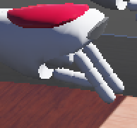

# NAO Robot - Italian Sign Language


## Table Of Content
* [Introduction](#introduction)
* [Getting Started](#getting-started)
    * [Prerequisites](#prerequisites)
    * [Install](#install)
    * [Run](#run)
* [The Dictionary](#the-dictionary)
* [Motions Details](#motions)
* [Authors](#authors)

## Introduction

## Getting Started
### Prerequisites
This project is tested on `Python 2.7`.

Before proceeding, install [Webots](https://cyberbotics.com) following the [official guide](https://cyberbotics.com/doc/guide/installing-webots).

### Install
* Clone this repository:
```
git clone https://github.com/FaMoSi/SocialRobot-ISL
```

* Change into it:
```
cd SocialRobot-ISL
```

* Edit the `local path` in [utils.py](./utils.py). It has to points to the `SocialRobot-ISL` cloned repository.

That's all, everything is installed and you can run the NAO-ISL robot!

### Run
You can run the project followint these steps:
* Open [Webots](https://cyberbotics.com).
* From the menu bar click on `File -> Open World...`.
* Select the [LIS-Nao.wbt](./worlds/LIS-Nao.wbt) file. You can find it in `~/SocialRobot-ISL/worlds/LIS-Nao.wbt`
* Click the **Play** button.
* Follow the instructions shown in the console.

**NB: The robot waits for pressed key. Make sure the 3D window of [Webots](https://cyberbotics.com) is selected and the simulation is running.**

## The Dictionary

## Motions

<details>
<summary><b><i>configuration</i></b></summary>
The <b>configuration</b> motions refer to specific <b>hand</b> configurations.
Their names can be <b>figurative</b> or <b>explicative</b>. 
<br>
To avoid confusion, here are shown the <b>configurations</b> for the <b>figurative</b> names:
<br>
<br>

Beak            |  Scratch
:-------------------------:|:-------------------------:
  |  


</details>


<details>
<summary><b><i>location</i></b></summary>
</details>

<details>
<summary><b><i>movement</i></b></summary>
</details>

<details>
<summary><b><i>orientation</i></b></summary>
</details>

## Authors
**[Simone Faggi](https://github.com/FaMoSi)** & **[Pietro Lami](https://github.com/PietroLami)**
